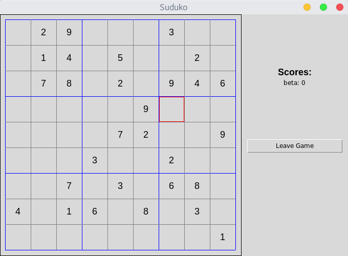

# DS-homework-2

This is a Suduko game implemented as the second project of the [Distributed Systems (MTAT.08.009)](https://courses.cs.ut.ee/2017/ds/fall)
at University of Tartu in Fall 2017. Its main functionalities include indictect communiatin and server discovery.

## Setup
**Dependencies**: tkinter and rabbitmq library.

To install the dependencies use following command:

```pip install -r requirements.txt```

*Note: tkinter is part of python but sometimes not installed. To install on Linux:

```sudo apt-get install python-tk```

After installing all requirements you can proceed with configurations. Our code uses rabbitmq and connects to the rabbitmq server using the guest user in order to connect using a remote machine you’ll need to change rabbitmq.conf - By default this file does not exist (on Linux). To do this configuration use setup.py script. Use following command:

```sudo python2.7 setup.py```

//TODO: this script needs to be extended for Windows and Macintosh

## Execution

Make sure that _tkinter_ is installed. You can use main scripts on the project root to run server and client applications.

Running the application:
- Navigate to the root of the repository
- Run python ```main_server.py -f name_of_sudoku```
- If no name is given, there will be a default sudoku
- Run python ```main_client.py -g```

If you want to add more sudoku puzzles, do the following:
- Create a sudoku puzzle as a csv file (empty fields filled with 0)
- Create another csv file with the solution to the sudoku puzzle
- Put both files in the _sudoku/puzzles_ folder
- It is important that the solution has the same name, with _solution added to it

For example if the sudoku puzzle is stored in the file _sudoku1.csv_ then the solution should be in the file _sudoku1_solution.csv_

## GUI Preview
For more info you can refer to the project [wiki page](https://github.com/hannesrandow/DS-homework-2/wiki/User-Manual).


## Notes

It is highly recommended to run the application on Linux.
